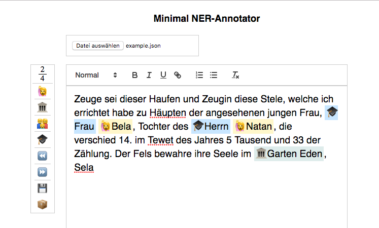

# minimal-RTE__ner-training-data
Minimal customization of [Quill.js](https://quilljs.com/) Rich Text Editor for easy annotation of text snippets for NER model training with, f.e. [spaCy](https://spacy.io/).

## Simple RTE for NER Annotation

The interface provides a simple file upload expecting JSON-files containing the following minimal structure:

```JSON
[
  { "text": "Lorem ipsum dolor sit."},
  { "text": "Amet adipiscit verum est."}
]
```

The object’s text property is displayed as text inside the RTE. Other properties present in the object’s are not processed and for internal use only, e.g. for referencing or license purposes.



The annotated texts can be downloaded as a JSON-file. The interface provides a single download of the currently active text or a bulk download of all texts. E.g.:

```JSON
[
    {
        "text": "Aufgestellt wurde ich, eine Stele, zu Häupten der Angesehenen, Frau Channa, Tochter des Herrn Alexander, die verschieden ist am 14. des Mondes Aw im Jahre 5 Tausend 32 der Zählung. Es sei ihre Seele im Garten Eden, Amen Sela",
        "entities": [
            [
                "50",
                "61",
                "TITLE"
            ],
            [
                "68",
                "74",
                "PERSON"
            ],
            [
                "88",
                "93",
                "TITLE"
            ],
            [
                "94",
                "103",
                "PERSON"
            ],
            [
                "202",
                "213",
                "PLACE"
            ]
        ]
    },
    {
        "text": "Zeuge sei dieser Haufen und Zeugin diese Stele, welche ich errichtet habe zu Häupten der angesehenen jungen Frau, Frau Bela, Tochter des Herrn Natan, die verschied 14. im Tewet des Jahres 5 Tausend und 33 der Zählung. Der Fels bewahre ihre Seele im Garten Eden, Sela",
        "entities": [
            [
                "114",
                "118",
                "TITLE"
            ],
            [
                "119",
                "123",
                "PERSON"
            ],
            [
                "137",
                "142",
                "TITLE"
            ],
            [
                "143",
                "148",
                "PERSON"
            ],
            [
                "249",
                "260",
                "PLACE"
            ]
        ]
    },
    {
        "text": "Diesen Stein, den setzte ich als Stele zu Häupten von Channa, der Jungfrau, Tochter des Herrn Elieser, die verschied Tag 2, 14. des Nissan 43 des sechsten Jahrtausends. Es sei ihre Seele im Garten Eden",
        "entities": []
    },
    {
        "text": "Dieses Zeichen, welches aufgestellt ward zu Häupten eines Liebenswürdigen, auch Liebenswerten, eingesenkt habe ich es zur Stele. Zu Grabe kam im Alter ein Stattlicher, Jaakow ward sein Name genannt inmitten des verstreuten Volkes, 28. des Adar, Tag 6, verschied Herr Jaakow, Sohn des toragelehrten Herrn Schlomo, 44 des Jahrtausends. Seine Seele sei eingebunden in das Bündel des Lebens, Amen Amen Sela",
        "entities": []
    }
]
```

## Sample data
The sample data contained in `data/texts/example.json` is taken from the first four epigraphic records of the catalogue [Frankfurt a.M., Battonstraße](http://www.steinheim-institut.de/cgi-bin/epidat?id=ffb), available on [_EPIDAT ─ Research Platform for Jewish Epigraphy_](http://www.steinheim-institut.de/cgi-bin/epidat?lang=en) built by [Thomas Kollatz](https://orcid.org/0000-0003-1904-1841). The epigraphic records are published under the [Creative Commons Attribution 4.0 International License](https://creativecommons.org/licenses/by/4.0/).
